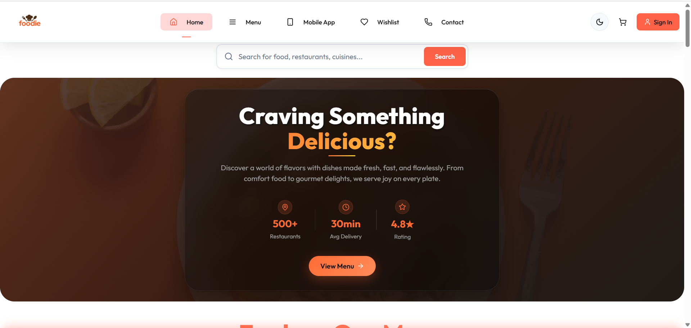

<<<<<<< HEAD
[
](https://discord.gg/r55948xy)

# EduHaven


## Overview

**EduHaven** is a platform designed to assist students in their academic journey by providing a productivity-focused environment. With features like task management, note-making, real-time study rooms, and a social touch, it aims to simplify and enhance the learning process. The project is built with the **MERN stack** and incorporates real-time collaboration, analytics, and optional AI-powered tools.

## Features

- **User Dashboard**: Tracks tasks completed, study time, and productivity stats.
- **Calendar & Events**: 
 - **User-Specific Events**: Each user can only view and manage their own calendar events
 - **Event Management**: Create, edit, and delete personal events with date/time
 - **Privacy & Security**: Secure authentication ensures event privacy across users
- **Enhanced Goals System**: 
 - **Data Persistence**: All goals persist in database across sessions
 - **Smart Organization**: Three collapsible sections (Daily Habits, Other Goals, Closed Goals)
 - **Repeat Functionality**: Daily habits automatically recreate when completed
 - **Deadline Tracking**: Visual indicators for time left, due today, or overdue
- **To-Do List**: Helps users organize and manage their tasks efficiently.
- **Note-Making**: Rich-text editor to create, edit, and organize notes.
- **Real-Time Study Rooms**:
 - Chat and collaborate with friends.
 - Video/audio controls using WebRTC.
- **Chatbot**: Provides productivity tips and answers academic questions.
- **Friends and Social Features**: Add friends, invite them to study rooms, and track their online/offline status.
- **Analytics**: Visualize progress with charts and insights.
- **Gamification**: Earn badges and track streaks to stay motivated.

## Tech Stack

- **Frontend**: React.js with CSS (or Tailwind CSS)
- **Backend**: Node.js with Express
- **Database**: MongoDB
- **Real-Time Communication**: Socket.IO, WebRTC

## Installation and Setup

### Prerequisites

- Node.js
- MongoDB
- Git

### Steps to Run Locally

1. After forking the repository, Clone the forked repository:

   ```bash
   git clone https://github.com/<your-username>/EduHaven.git
   cd EduHaven
   ```

2. Install dependencies:

   ```bash
   # Install backend dependencies
   cd Server
   npm install

   # Install frontend dependencies
   cd ../Client
   npm install
   ```

3. Set up environment variables:

   - **for frontend:**

     - create a `.env` file in the `/Client` directory, and copy all the contents from `.env.example`.

   - **for backend:**

     - Create a `.env` file in the `/Server` directory.
     - Follow the instructions provided in `.env.example` file to create a new `.env` file for backend.

4. Start the development servers:

   ```bash
   # Start backend server
   cd Server
   npm run dev

   # Start frontend server
   cd ../Client
   npm run dev
   ```

## Contribution Guidelines

1. You must get assigned to the issue so others know you're working on it. leave comment to get issue assigned.
2. Code must be properly formatted. (use preetier)
3. Commits should generally be minimal
4. The body of the commit message should explain why and how the change was made.It should provide clear context for all changes mage that will help both a reviewer now, and a developer looking at your changes a year later, understand the motivation behind your decisions.

We welcome contributions to make **EduHaven** better for students everywhere! Here’s how you can contribute:

1. Fork the repository.
2. Create a new branch for your feature/bugfix:
   ```bash
   git checkout -b feature-name
   ```
3. Make your changes and test them thoroughly.
- For frontend changes, also run:
  ```bash
  npm run build
  ```
  and verify there are no build errors. 

4. Commit and push your changes:
   ```bash
   git add .
   git commit -m "Add a brief description of your changes"
   git push origin feature-name
   ```
5. Before pushing frontend changes, **run** `npm run build` locally to ensure the project builds successfully. Catch & solve any potential deployment issues early, if any.
6. Create a Pull Request (PR) with a detailed explanation of your changes.

## Roadmap

1. **Phase 1**: Core features - User authentication, to-do list, note-making.
2. **Phase 2**: Real-time study rooms, chatbot integration, and social features.
3. **Phase 3**: Analytics, gamification, and AI-powered enhancements.
4. **Phase 4**: Mobile app development and premium features.

## License

This project is licensed under the MIT License - see the [LICENSE](LICENSE) file for details.

## Acknowledgments

- Special thanks to contributors for their efforts in building **EduHaven**.
- Inspired by productivity tools and online collaborative platforms.

---


## Preventing Backend Cold Starts
The backend is hosted on Render Free Tier and may go to sleep after short inactivity.  
We have implemented a keep-alive solution using [cron-job.org](https://cron-job.org/) to ping the backend every 1 minute:

- URL: https://eduhaven-backend.onrender.com/
- Interval: Every 1 minute
- Purpose: Prevents backend cold starts for faster response times.

For full details, see [`KEEP_ALIVE.md`](KEEP_ALIVE.md).


For any further queries, feel free to reach out on our whatsApp group. Let’s make learning fun and productive!
=======
# 🍽️ Foodie – Full-Stack Restaurant App

A full-stack web application for browsing, listing, and managing a variety of food items. Built using React (Frontend), Express.js (Backend), and MongoDB.


<sup>Homepage – Light Mode</sup>

---

## 🚀 Quick Navigation

> **📚 New to Foodie? Complete Developer Guide**  
> 👉 **[LEARN.md](./LEARN.md)** – Architecture, setup, contribution pathways, and everything you need to get started!

> **⚡ Want to jump right in?**  
> Skip to [Getting Started](#-getting-started) for quick setup instructions.

---

## 📑 Table of Contents

* [🔧 Tech Stack](#-tech-stack)

  * [🖥️ Frontend](#️-frontend)
  * [🌐 Backend](#-backend)
  * [🗄️ Database](#️-database)
* [🚀 Getting Started](#-getting-started)

  * [Prerequisites](#prerequisites)
  * [📦 Installation](#-installation)
  * [🐳 Docker Setup (Recommended)](#-docker-setup-recommended)
  * [📦 Manual Installation](#-manual-installation)
  * [🔧 Development Setup](#-development-setup)
* [📁 Project Structure](#-project-structure)
* [🐳 Docker Commands](#-docker-commands)
* [🧪 Linting](#-linting)
* [🧰 Scripts](#-scripts)
* [📝 Notes](#-notes)
* [🤝 Contributing](#-contributing)
* [📄 License](#-license)
* [🔗 References](#-references)

---

## 🔧 Tech Stack

### 🖥️ Frontend

* **React 18.3** – User interface
* **Vite** – Fast build tool and dev server
* **React Router DOM** – Client-side routing
* **ESLint** – Linting and code style enforcement

### 🌐 Backend

* **Node.js + Express** – REST API server
* **CORS + JSON Middleware** – Cross-origin requests
* **Multer** – File upload handling
* **Modular API Routing** – Organized route structure

### 🗄️ Database

* **MongoDB** – NoSQL database for data storage

### 🐳 DevOps

* **Docker** – Containerization for all services
* **Docker Compose** – Multi-service orchestration

---

## 🚀 Getting Started

### Prerequisites

Ensure you have the following installed:

**For Docker Setup (Recommended):**

* Docker Desktop
* Docker Compose

**For Manual Setup:**

* Node.js (v16 or above)
* npm or yarn
* MongoDB (local or cloud)

---

### 📦 Installation

#### 🐳 Docker Setup (Recommended)

**One-command setup for the entire application:**

```bash
# Clone the repository
git clone https://github.com/your-username/foodie.git
cd foodie
npm install

# Start all services with Docker
docker-compose up --build
```

**Access the application:**

* 🌐 **Frontend**: [http://localhost:3000](http://localhost:3000)
* 🛠️ **Admin Panel**: [http://localhost:5173](http://localhost:5173)
* 🔌 **Backend API**: [http://localhost:4000](http://localhost:4000)
* 🗄️ **MongoDB**: localhost:27017

**Docker Services:**

* **foodie-frontend**: React app (Port 3000)
* **foodie-admin**: Admin panel (Port 5173)
* **foodie-backend**: Express API (Port 4000)
* **foodie-mongodb**: MongoDB database (Port 27017)

---

#### 📦 Manual Installation

```bash
# Clone the repository
git clone https://github.com/your-username/foodie.git
cd foodie

# Install dependencies for all services
cd frontend && npm install && cd ..
cd backend && npm install && cd ..
cd admin && npm install && cd ..
```

---

### 🔧 Development Setup

#### Docker Development

```bash
# Start all services
docker-compose up

# Start in detached mode
docker-compose up -d

# View logs for specific service
docker-compose logs frontend
docker-compose logs backend
docker-compose logs admin
```

#### Manual Development

**Start Frontend:**

```bash
cd frontend
npm run dev
```

**Start Admin Panel:**

```bash
cd admin
npm run dev
```

**Start Backend:**

```bash
cd backend
npm run server
```

Server runs on `http://localhost:4000`

**Start MongoDB:**

```bash
# Make sure MongoDB is running locally
mongod
```

---

## 📁 Project Structure

```
Foodie/
├── frontend/                 # React frontend application
│   ├── src/
│   ├── Dockerfile
│   ├── .dockerignore
│   └── package.json
├── backend/                  # Express.js backend API
│   ├── routes/
│   ├── config/
│   ├── uploads/
│   ├── server.js
│   ├── Dockerfile
│   ├── .dockerignore
│   └── package.json
├── admin/                    # React admin panel
│   ├── src/
│   ├── Dockerfile
│   ├── .dockerignore
│   └── package.json
├── docker-compose.yml        # Multi-service orchestration
├── .dockerignore             # Root Docker ignore file
├── README.md
└── CONTRIBUTING.md
```

---

## 🐳 Docker Commands

### Basic Operations

```bash
# Build and start all services
docker-compose up --build

# Start services in background
docker-compose up -d

# Stop all services
docker-compose down

# Stop and remove volumes (⚠️ deletes database data)
docker-compose down -v

# Restart specific service
docker-compose restart backend

# View running containers
docker-compose ps
```

### Development Commands

```bash
# View logs for all services
docker-compose logs

# View logs for specific service
docker-compose logs -f frontend

# Execute commands in running container
docker-compose exec backend npm install new-package

# Rebuild specific service
docker-compose build backend
```

### Database Management

```bash
# Access MongoDB shell
docker-compose exec mongodb mongosh

# Backup database
docker-compose exec mongodb mongodump --out /backup

# View MongoDB logs
docker-compose logs mongodb
```

---

## 🧪 Linting

ESLint is pre-configured with React and Hooks rules for frontend and admin.

```bash
# Frontend linting
cd frontend && npm run lint

# Admin linting
cd admin && npm run lint
```

---

## 🧰 Scripts

### Frontend & Admin Scripts

| Command           | Description                   |
| ----------------- | ----------------------------- |
| `npm run dev`     | Start Vite development server |
| `npm run build`   | Build for production          |
| `npm run preview` | Preview production build      |
| `npm run lint`    | Run ESLint checks             |

### Backend Scripts

| Command          | Description                           |
| ---------------- | ------------------------------------- |
| `npm start`      | Start production server               |
| `npm run server` | Start development server with nodemon |

---

## 📝 Notes

* Make sure MongoDB is running locally or update `connectDB()` in `config/db.js` accordingly.
* You can update the backend routes via `routes/foodRoute.js`.

### Environment Variables

The application uses the following environment variables:

**Backend:**

* `MONGODB_URI`: MongoDB connection string
* `JWT_SECRET`: Secret key for JWT tokens
* `PORT`: Server port (default: 4000)

**Frontend:**

* `REACT_APP_API_URL`: Backend API URL

**Admin:**

* `VITE_API_URL`: Backend API URL for Vite

### Database Configuration

* **Docker**: MongoDB runs automatically with authentication

  * Username: `admin`
  * Password: `password123`
  * Database: `foodie`
* **Manual**: Update `connectDB()` in `backend/config/db.js`

### File Uploads

* Backend handles file uploads via Multer
* Files are stored in `backend/uploads/` directory
* Docker setup includes volume mounting for persistence

---

## 🤝 Contributing

We welcome contributions to the Foodie project! If you find this project helpful, consider starring the repo or opening an issue.

* 📖 Help improve documentation
* 🚀 For more info go to [CONTRIBUTING.md](CONTRIBUTING.md)

### Development Workflow

1. Fork the repository
2. Create a feature branch
3. Use Docker for consistent development environment
4. Test your changes with `docker-compose up --build`
5. Submit a pull request

---

## 📄 License

This project is licensed under the MIT License.

---

## 🔗 References

* [React](https://reactjs.org/)
* [Vite](https://vitejs.dev/)
* [Express](https://expressjs.com/)
* [MongoDB](https://www.mongodb.com/)
* [Docker](https://www.docker.com/)
>>>>>>> 71fe6a6a68a86e1cd8d4e6e71de3b146182f9a80
